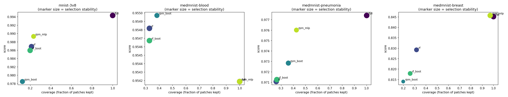

# Real-Data Benchmark Summary (scientific image sets)

Score is AUC (binary) or accuracy-equivalent OVR AUC (multiclass); higher is better. `coverage` is the fraction of patches kept, `stability` the mean pairwise Jaccard of selections across folds, `border_coverage` the fraction of the outer patch ring retained (a background-rejection diagnostic for centred imagery).

## mnist-3v8

| mnist-3v8 | score | coverage | stability | border_coverage | seconds |
| --- | --- | --- | --- | --- | --- |
| full | 0.994 | 1.000 | 1.000 | 1.000 | 12.112 |
| rf | 0.987 | 0.212 | 0.922 | 0.000 | 18.823 |
| rpm_boot | 0.979 | 0.124 | 0.762 | 0.011 | 16.895 |
| rf_boot | 0.986 | 0.199 | 0.953 | 0.000 | 90.692 |
| rpm_mlp | 0.989 | 0.231 | 0.683 | 0.042 | 39.635 |

## medmnist-blood

| medmnist-blood | score | coverage | stability | border_coverage | seconds |
| --- | --- | --- | --- | --- | --- |
| full | 0.954 | 1.000 | 1.000 | 1.000 | 22.287 |
| rf | 0.955 | 0.327 | 1.000 | 0.000 | 36.917 |
| rpm_boot | 0.955 | 0.384 | 0.799 | 0.006 | 38.846 |
| rf_boot | 0.955 | 0.328 | 0.992 | 0.000 | 155.526 |
| rpm_mlp | 0.954 | 1.000 | 1.000 | 1.000 | 62.039 |

## medmnist-pneumonia

| medmnist-pneumonia | score | coverage | stability | border_coverage | seconds |
| --- | --- | --- | --- | --- | --- |
| full | 0.977 | 1.000 | 1.000 | 1.000 | 12.394 |
| rf | 0.971 | 0.260 | 0.964 | 0.117 | 17.692 |
| rpm_boot | 0.973 | 0.359 | 0.805 | 0.247 | 16.338 |
| rf_boot | 0.971 | 0.264 | 0.990 | 0.122 | 98.367 |
| rpm_mlp | 0.976 | 0.426 | 0.703 | 0.328 | 42.432 |

## medmnist-breast

| medmnist-breast | score | coverage | stability | border_coverage | seconds |
| --- | --- | --- | --- | --- | --- |
| full | 0.845 | 1.000 | 1.000 | 1.000 | 4.412 |
| rf | 0.829 | 0.316 | 0.667 | 0.281 | 6.705 |
| rpm_boot | 0.814 | 0.197 | 0.319 | 0.236 | 6.869 |
| rf_boot | 0.818 | 0.259 | 0.638 | 0.211 | 33.979 |
| rpm_mlp | 0.846 | 0.970 | 0.943 | 0.969 | 12.590 |

## Figures

