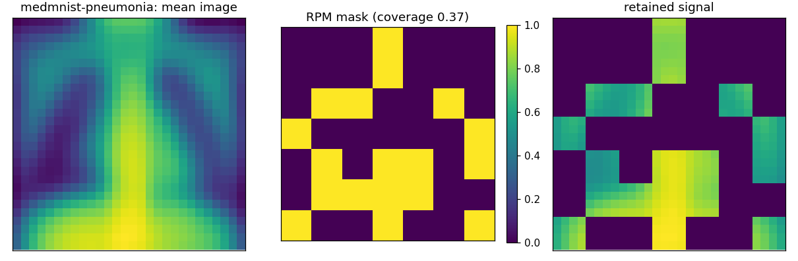
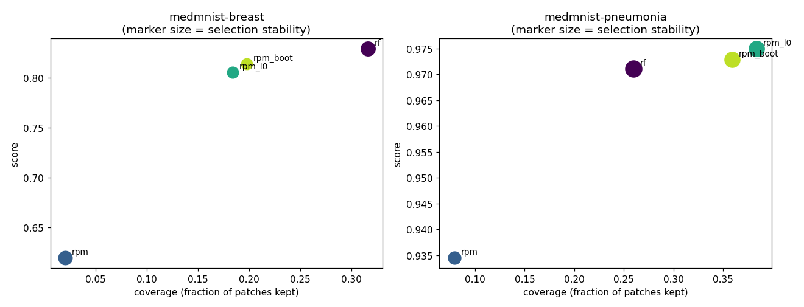

# Real-Data Benchmark Summary (scientific image sets)

Score is AUC (binary) or accuracy-equivalent OVR AUC (multiclass); higher is better. `coverage` is the fraction of patches kept, `stability` the mean pairwise Jaccard of selections across folds, `border_coverage` the fraction of the outer patch ring retained (a background-rejection diagnostic for centred imagery).

## medmnist-breast

| medmnist-breast | score | coverage | stability | border_coverage | seconds |
| --- | --- | --- | --- | --- | --- |
| rf | 0.829 | 0.316 | 0.667 | 0.281 | 20.987 |
| rpm | 0.620 | 0.020 | 0.600 | 0.003 | 6.579 |
| rpm_l0 | 0.806 | 0.184 | 0.340 | 0.222 | 9.875 |
| rpm_boot | 0.814 | 0.197 | 0.319 | 0.236 | 21.271 |

## medmnist-pneumonia

| medmnist-pneumonia | score | coverage | stability | border_coverage | seconds |
| --- | --- | --- | --- | --- | --- |
| rf | 0.971 | 0.260 | 0.964 | 0.117 | 47.459 |
| rpm | 0.935 | 0.079 | 0.478 | 0.078 | 13.665 |
| rpm_l0 | 0.975 | 0.384 | 0.818 | 0.292 | 22.650 |
| rpm_boot | 0.973 | 0.359 | 0.805 | 0.247 | 50.143 |

## Figures

