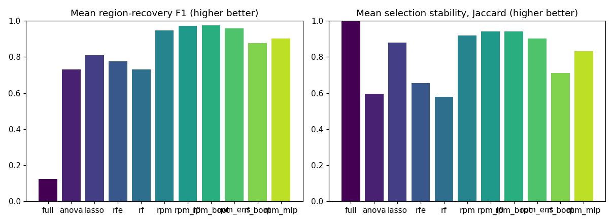
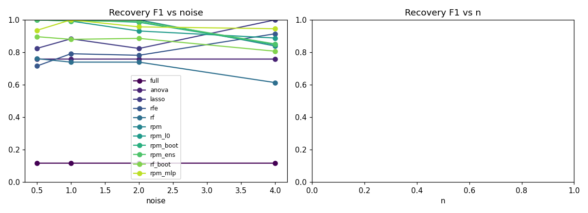
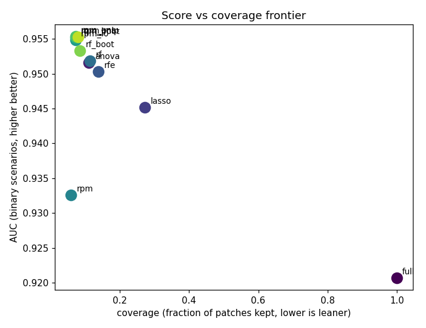

# Synthetic Benchmark Summary (gate_ablation)

Rows: 231  |  methods: ['anova', 'full', 'lasso', 'rf', 'rf_boot', 'rfe', 'rpm', 'rpm_boot', 'rpm_ens', 'rpm_l0', 'rpm_mlp']  |  scenarios: 7  |  seeds: [np.int64(0), np.int64(1), np.int64(2)]

Metrics: **f1/iou/precision/recall** = patch-level recovery of the known informative region; **distractor_fp** = fraction of the non-predictive distractor wrongly selected (lower better); **coverage** = fraction of patches kept; **stability** = mean pairwise Jaccard of selections across folds; **score** = AUC (binary, higher better) or RMSE (regression, lower better).

## Headline (mean over all scenarios and seeds)

| method | f1 | iou | precision | recall | distractor_fp | coverage | stability | seconds | selects |
| --- | --- | --- | --- | --- | --- | --- | --- | --- | --- |
| full | 0.124 | 0.067 | 0.067 | 1.000 | 1.000 | 1.000 | 1.000 | 2.788 | no |
| anova | 0.732 | 0.601 | 0.601 | 1.000 | 0.038 | 0.111 | 0.596 | 1.672 | yes |
| lasso | 0.809 | 0.787 | 0.787 | 1.000 | 0.221 | 0.272 | 0.878 | 2.837 | yes |
| rfe | 0.777 | 0.716 | 0.716 | 1.000 | 0.005 | 0.138 | 0.654 | 2.655 | yes |
| rf | 0.731 | 0.594 | 0.594 | 1.000 | 0.026 | 0.114 | 0.579 | 4.030 | yes |
| rpm | 0.948 | 0.927 | 1.000 | 0.927 | 0.000 | 0.059 | 0.920 | 1.932 | yes |
| rpm_l0 | 0.972 | 0.952 | 0.952 | 1.000 | 0.002 | 0.072 | 0.940 | 2.033 | yes |
| rpm_boot | 0.974 | 0.958 | 0.958 | 1.000 | 0.007 | 0.071 | 0.941 | 5.522 | yes |
| rpm_ens | 0.958 | 0.932 | 0.932 | 1.000 | 0.000 | 0.072 | 0.903 | 15.069 | yes |
| rf_boot | 0.875 | 0.794 | 0.795 | 0.999 | 0.002 | 0.085 | 0.712 | 24.450 | yes |
| rpm_mlp | 0.901 | 0.871 | 0.871 | 1.000 | 0.014 | 0.079 | 0.831 | 11.312 | yes |

`selects` is `no` where an arm kept the whole image (coverage at or above 0.999). Such an arm is not a selection result: its score is the full-image score and its stability is 1.000 because keeping everything is perfectly reproducible. Compare it against `full`, not against the selectors. A `yes` is not a claim that the arm selected WELL: coverage 0.956 is marked `yes` and is barely a selection, so read the coverage column alongside the score rather than treating this as a pass mark.

## Binary score vs coverage vs stability (mean over binary scenarios/seeds)

| method(AUC) | score | coverage | stability | f1 | selects |
| --- | --- | --- | --- | --- | --- |
| full | 0.921 | 1.000 | 1.000 | 0.124 | no |
| anova | 0.952 | 0.111 | 0.596 | 0.732 | yes |
| lasso | 0.945 | 0.272 | 0.878 | 0.809 | yes |
| rfe | 0.950 | 0.138 | 0.654 | 0.777 | yes |
| rf | 0.952 | 0.114 | 0.579 | 0.731 | yes |
| rpm | 0.933 | 0.059 | 0.920 | 0.948 | yes |
| rpm_l0 | 0.955 | 0.072 | 0.940 | 0.972 | yes |
| rpm_boot | 0.955 | 0.071 | 0.941 | 0.974 | yes |
| rpm_ens | 0.955 | 0.072 | 0.903 | 0.958 | yes |
| rf_boot | 0.953 | 0.085 | 0.712 | 0.875 | yes |
| rpm_mlp | 0.955 | 0.079 | 0.831 | 0.901 | yes |

## Recovery F1 vs noise

| noise | full | anova | lasso | rfe | rf | rpm | rpm_l0 | rpm_boot | rpm_ens | rf_boot | rpm_mlp |
| --- | --- | --- | --- | --- | --- | --- | --- | --- | --- | --- | --- |
| 0.5 | 0.118 | 0.759 | 0.824 | 0.715 | 0.761 | 1.000 | 1.000 | 1.000 | 1.000 | 0.896 | 0.936 |
| 1.0 | 0.118 | 0.759 | 0.883 | 0.791 | 0.739 | 1.000 | 0.993 | 1.000 | 0.993 | 0.880 | 1.000 |
| 2.0 | 0.118 | 0.759 | 0.824 | 0.782 | 0.739 | 1.000 | 0.931 | 0.985 | 0.993 | 0.886 | 0.957 |
| 4.0 | 0.118 | 0.759 | 1.000 | 0.914 | 0.613 | 0.839 | 0.888 | 0.847 | 0.851 | 0.807 | 0.945 |

## Recovery F1 vs region size

| region_side | full | anova | lasso | rfe | rf | rpm | rpm_l0 | rpm_boot | rpm_ens | rf_boot | rpm_mlp |
| --- | --- | --- | --- | --- | --- | --- | --- | --- | --- | --- | --- |
| 1 | 0.031 | 0.500 | 1.000 | 0.550 | 0.664 | 1.000 | 1.000 | 1.000 | 0.878 | 0.833 | 0.483 |
| 2 | 0.118 | 0.703 | 0.875 | 0.954 | 0.727 | 1.000 | 1.000 | 0.993 | 0.993 | 0.882 | 0.993 |
| 3 | 0.247 | 0.884 | 0.254 | 0.731 | 0.875 | 0.798 | 0.989 | 0.996 | 0.996 | 0.944 | 0.996 |

## Figures

