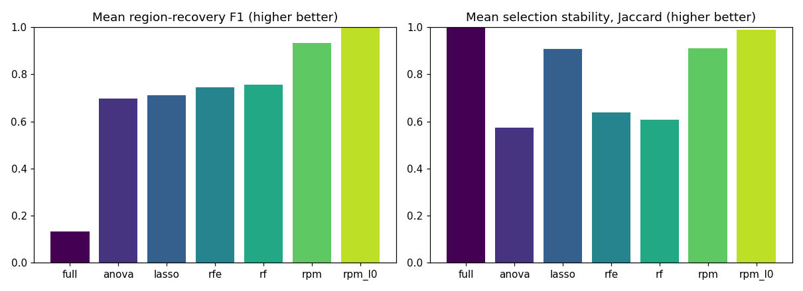
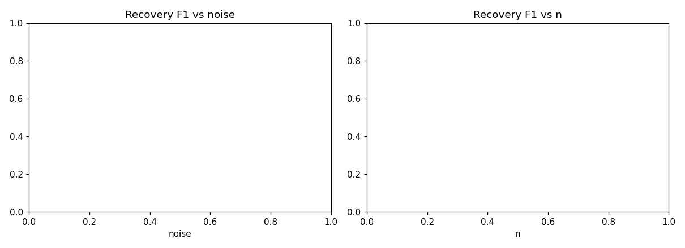
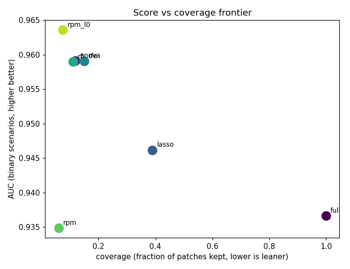

# Synthetic Benchmark Summary (gate_region)

Rows: 63  |  methods: ['anova', 'full', 'lasso', 'rf', 'rfe', 'rpm', 'rpm_l0']  |  scenarios: 3  |  seeds: [np.int64(0), np.int64(1), np.int64(2)]

Metrics: **f1/iou/precision/recall** = patch-level recovery of the known informative region; **distractor_fp** = fraction of the non-predictive distractor wrongly selected (lower better); **coverage** = fraction of patches kept; **stability** = mean pairwise Jaccard of selections across folds; **score** = AUC (binary, higher better) or RMSE (regression, lower better).

## Headline (mean over all scenarios and seeds)

| method | f1 | iou | precision | recall | distractor_fp | coverage | stability | seconds |
| --- | --- | --- | --- | --- | --- | --- | --- | --- |
| full | 0.132 | 0.073 | 0.073 | 1.000 | 1.000 | 1.000 | 1.000 | 10.049 |
| anova | 0.696 | 0.569 | 0.569 | 1.000 | 0.022 | 0.118 | 0.572 | 7.323 |
| lasso | 0.710 | 0.669 | 0.669 | 1.000 | 0.350 | 0.389 | 0.907 | 14.413 |
| rfe | 0.745 | 0.678 | 0.678 | 1.000 | 0.006 | 0.149 | 0.638 | 10.734 |
| rf | 0.755 | 0.632 | 0.632 | 1.000 | 0.033 | 0.110 | 0.608 | 15.814 |
| rpm | 0.933 | 0.901 | 1.000 | 0.901 | 0.000 | 0.059 | 0.909 | 7.466 |
| rpm_l0 | 0.996 | 0.993 | 0.993 | 1.000 | 0.000 | 0.074 | 0.989 | 8.975 |

## Binary score vs coverage vs stability (mean over binary scenarios/seeds)

| method(AUC) | score | coverage | stability | f1 |
| --- | --- | --- | --- | --- |
| full | 0.937 | 1.000 | 1.000 | 0.132 |
| anova | 0.959 | 0.118 | 0.572 | 0.696 |
| lasso | 0.946 | 0.389 | 0.907 | 0.710 |
| rfe | 0.959 | 0.149 | 0.638 | 0.745 |
| rf | 0.959 | 0.110 | 0.608 | 0.755 |
| rpm | 0.935 | 0.059 | 0.909 | 0.933 |
| rpm_l0 | 0.964 | 0.074 | 0.989 | 0.996 |

## Recovery F1 vs region size

| region_side | full | anova | lasso | rfe | rf | rpm | rpm_l0 |
| --- | --- | --- | --- | --- | --- | --- | --- |
| 1 | 0.031 | 0.500 | 1.000 | 0.550 | 0.664 | 1.000 | 1.000 |
| 2 | 0.118 | 0.703 | 0.875 | 0.954 | 0.727 | 1.000 | 1.000 |
| 3 | 0.247 | 0.884 | 0.254 | 0.731 | 0.875 | 0.798 | 0.989 |

## Figures

