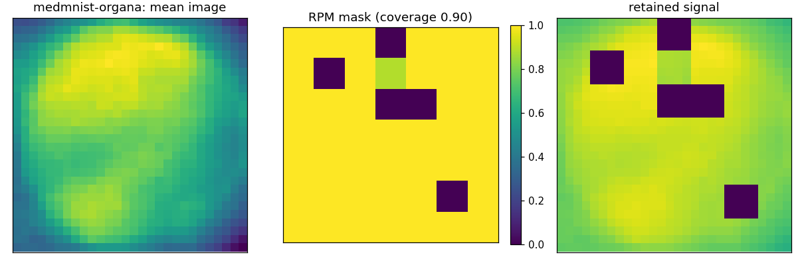
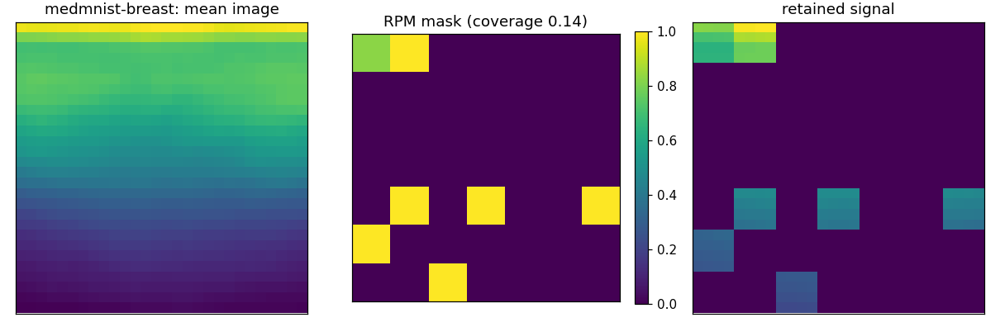
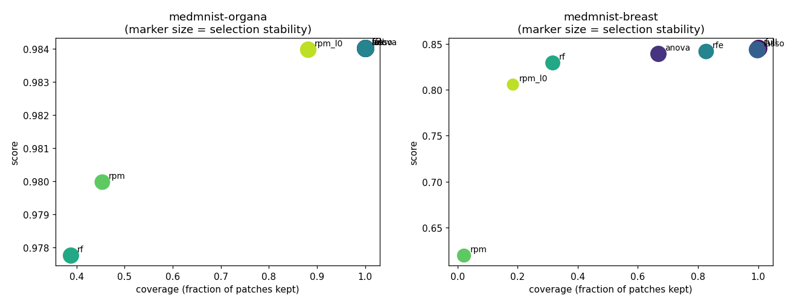

# Real-Data Benchmark Summary (scientific image sets)

Score is AUC (binary) or accuracy-equivalent OVR AUC (multiclass); higher is better. `coverage` is the fraction of patches kept, `stability` the mean pairwise Jaccard of selections across folds, `border_coverage` the fraction of the outer patch ring retained (a background-rejection diagnostic for centred imagery).

## medmnist-organa

| medmnist-organa | score | coverage | stability | border_coverage | seconds |
| --- | --- | --- | --- | --- | --- |
| full | 0.984 | 1.000 | 1.000 | 1.000 | 21.865 |
| anova | 0.984 | 1.000 | 1.000 | 1.000 | 20.615 |
| lasso | 0.984 | 1.000 | 1.000 | 1.000 | 104.110 |
| rfe | 0.984 | 1.000 | 1.000 | 1.000 | 23.077 |
| rf | 0.978 | 0.388 | 0.834 | 0.333 | 35.170 |
| rpm | 0.980 | 0.453 | 0.749 | 0.547 | 21.042 |
| rpm_l0 | 0.984 | 0.882 | 0.876 | 0.917 | 25.644 |

## medmnist-breast

| medmnist-breast | score | coverage | stability | border_coverage | seconds |
| --- | --- | --- | --- | --- | --- |
| full | 0.845 | 1.000 | 1.000 | 1.000 | 5.639 |
| anova | 0.839 | 0.668 | 0.842 | 0.567 | 4.395 |
| lasso | 0.844 | 0.997 | 0.995 | 0.997 | 7.263 |
| rfe | 0.842 | 0.826 | 0.737 | 0.833 | 5.943 |
| rf | 0.829 | 0.316 | 0.667 | 0.281 | 8.472 |
| rpm | 0.620 | 0.020 | 0.550 | 0.003 | 2.996 |
| rpm_l0 | 0.806 | 0.184 | 0.340 | 0.222 | 4.206 |

## Figures

