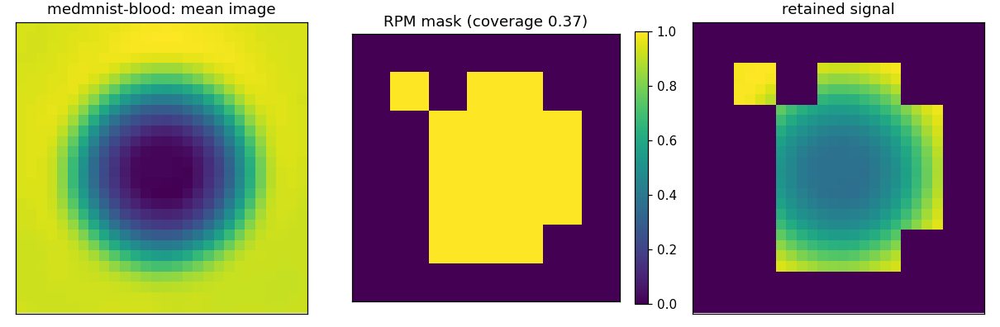
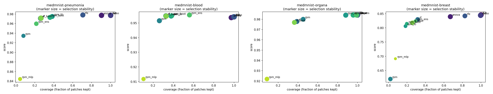

# Real-Data Benchmark Summary (scientific image sets)

Score is AUC (binary) or accuracy-equivalent OVR AUC (multiclass); higher is better. `coverage` is the fraction of patches kept, `stability` the mean pairwise Jaccard of selections across folds, `border_coverage` the fraction of the outer patch ring retained (a background-rejection diagnostic for centred imagery).

`selects` is `no` where an arm kept the whole image (coverage at or above 0.999). Such an arm is not a selection result: its score is the full-image score and its stability is 1.000 because keeping everything is perfectly reproducible. Compare it against `full`, not against the selectors. A `yes` is not a claim that the arm selected WELL: coverage 0.956 is marked `yes` and is barely a selection, so read the coverage column alongside the score rather than treating this as a pass mark.

## medmnist-pneumonia

| medmnist-pneumonia | score | coverage | stability | border_coverage | seconds | selects |
| --- | --- | --- | --- | --- | --- | --- |
| full | 0.977 | 1.000 | 1.000 | 1.000 | 13.893 | no |
| anova | 0.977 | 0.903 | 0.982 | 0.844 | 12.488 | yes |
| lasso | 0.977 | 1.000 | 1.000 | 1.000 | 20.114 | no |
| rfe | 0.978 | 0.706 | 0.869 | 0.589 | 11.704 | yes |
| rf | 0.971 | 0.260 | 0.964 | 0.117 | 18.034 | yes |
| rpm | 0.935 | 0.079 | 0.478 | 0.078 | 6.338 | yes |
| rpm_l0 | 0.975 | 0.384 | 0.818 | 0.292 | 9.533 | yes |
| rpm_boot | 0.973 | 0.359 | 0.805 | 0.247 | 16.267 | yes |
| rpm_ens | 0.960 | 0.215 | 0.616 | 0.136 | 68.603 | yes |
| rf_boot | 0.971 | 0.264 | 0.990 | 0.122 | 109.703 | yes |
| rpm_mlp | 0.844 | 0.044 | 0.409 | 0.044 | 55.790 | yes |

## medmnist-blood

| medmnist-blood | score | coverage | stability | border_coverage | seconds | selects |
| --- | --- | --- | --- | --- | --- | --- |
| full | 0.954 | 1.000 | 1.000 | 1.000 | 27.996 | no |
| anova | 0.954 | 0.973 | 0.975 | 0.944 | 33.187 | yes |
| lasso | 0.954 | 0.997 | 0.995 | 0.994 | 81.698 | yes |
| rfe | 0.954 | 1.000 | 1.000 | 1.000 | 29.575 | no |
| rf | 0.955 | 0.327 | 1.000 | 0.000 | 33.912 | yes |
| rpm | 0.952 | 0.263 | 0.845 | 0.000 | 15.848 | yes |
| rpm_l0 | 0.955 | 0.378 | 0.837 | 0.006 | 20.751 | yes |
| rpm_boot | 0.955 | 0.384 | 0.799 | 0.006 | 47.923 | yes |
| rpm_ens | 0.955 | 0.559 | 0.804 | 0.136 | 146.250 | yes |
| rf_boot | 0.955 | 0.328 | 0.992 | 0.000 | 156.057 | yes |
| rpm_mlp | 0.912 | 0.105 | 0.516 | 0.000 | 68.113 | yes |

## medmnist-organa

| medmnist-organa | score | coverage | stability | border_coverage | seconds | selects |
| --- | --- | --- | --- | --- | --- | --- |
| full | 0.984 | 1.000 | 1.000 | 1.000 | 22.727 | no |
| anova | 0.984 | 1.000 | 1.000 | 1.000 | 22.701 | no |
| lasso | 0.984 | 1.000 | 1.000 | 1.000 | 66.011 | no |
| rfe | 0.984 | 1.000 | 1.000 | 1.000 | 23.996 | no |
| rf | 0.978 | 0.388 | 0.834 | 0.333 | 32.356 | yes |
| rpm | 0.980 | 0.453 | 0.749 | 0.547 | 20.322 | yes |
| rpm_l0 | 0.984 | 0.882 | 0.876 | 0.917 | 25.483 | yes |
| rpm_boot | 0.984 | 0.956 | 0.967 | 0.964 | 58.051 | yes |
| rpm_ens | 0.984 | 0.990 | 0.982 | 0.994 | 168.527 | yes |
| rf_boot | 0.977 | 0.363 | 0.781 | 0.319 | 159.733 | yes |
| rpm_mlp | 0.922 | 0.087 | 0.646 | 0.133 | 88.745 | yes |

## medmnist-breast

| medmnist-breast | score | coverage | stability | border_coverage | seconds | selects |
| --- | --- | --- | --- | --- | --- | --- |
| full | 0.845 | 1.000 | 1.000 | 1.000 | 6.158 | no |
| anova | 0.839 | 0.668 | 0.842 | 0.567 | 4.881 | yes |
| lasso | 0.844 | 0.997 | 0.995 | 0.997 | 8.542 | yes |
| rfe | 0.842 | 0.826 | 0.737 | 0.833 | 6.674 | yes |
| rf | 0.829 | 0.316 | 0.667 | 0.281 | 9.130 | yes |
| rpm | 0.620 | 0.020 | 0.600 | 0.003 | 3.609 | yes |
| rpm_l0 | 0.806 | 0.184 | 0.340 | 0.222 | 4.112 | yes |
| rpm_boot | 0.814 | 0.197 | 0.319 | 0.236 | 10.042 | yes |
| rpm_ens | 0.824 | 0.291 | 0.300 | 0.328 | 23.577 | yes |
| rf_boot | 0.818 | 0.259 | 0.638 | 0.211 | 44.707 | yes |
| rpm_mlp | 0.691 | 0.075 | 0.096 | 0.067 | 19.518 | yes |

## Figures

