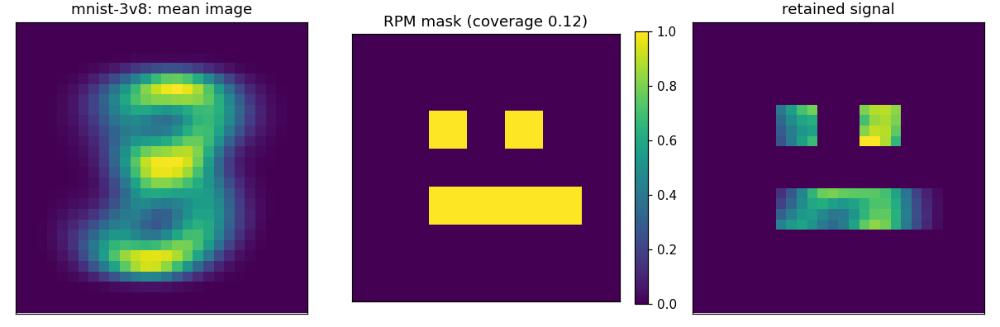
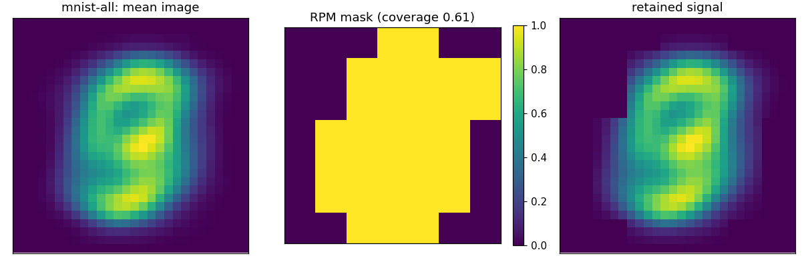
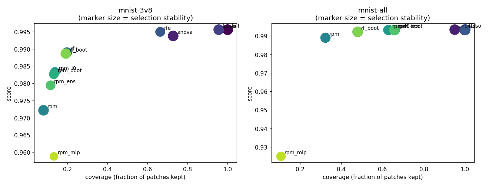

# Real-Data Benchmark Summary (scientific image sets)

Score is AUC (binary) or accuracy-equivalent OVR AUC (multiclass); higher is better. `coverage` is the fraction of patches kept, `stability` the mean pairwise Jaccard of selections across folds, `border_coverage` the fraction of the outer patch ring retained (a background-rejection diagnostic for centred imagery).

`selects` is `no` where an arm kept the whole image (coverage at or above 0.999). Such an arm is not a selection result: its score is the full-image score and its stability is 1.000 because keeping everything is perfectly reproducible. Compare it against `full`, not against the selectors. A `yes` is not a claim that the arm selected WELL: coverage 0.956 is marked `yes` and is barely a selection, so read the coverage column alongside the score rather than treating this as a pass mark.

## mnist-3v8

| mnist-3v8 | score | coverage | stability | border_coverage | seconds | selects |
| --- | --- | --- | --- | --- | --- | --- |
| full | 0.996 | 1.000 | 1.000 | 1.000 | 12.645 | no |
| anova | 0.994 | 0.728 | 0.969 | 0.636 | 11.327 | yes |
| lasso | 0.996 | 0.955 | 0.991 | 0.908 | 19.002 | yes |
| rfe | 0.995 | 0.663 | 0.805 | 0.442 | 12.654 | yes |
| rf | 0.989 | 0.197 | 0.919 | 0.000 | 17.204 | yes |
| rpm | 0.972 | 0.080 | 0.967 | 0.000 | 9.035 | yes |
| rpm_l0 | 0.983 | 0.137 | 0.789 | 0.019 | 8.697 | yes |
| rpm_boot | 0.983 | 0.132 | 0.778 | 0.014 | 23.316 | yes |
| rpm_ens | 0.979 | 0.114 | 0.773 | 0.000 | 93.937 | yes |
| rf_boot | 0.989 | 0.190 | 0.937 | 0.000 | 77.359 | yes |
| rpm_mlp | 0.959 | 0.132 | 0.530 | 0.017 | 76.200 | yes |

## mnist-all

| mnist-all | score | coverage | stability | border_coverage | seconds | selects |
| --- | --- | --- | --- | --- | --- | --- |
| full | 0.993 | 1.000 | 1.000 | 1.000 | 19.229 | no |
| anova | 0.993 | 0.950 | 0.979 | 0.897 | 20.306 | yes |
| lasso | 0.993 | 0.999 | 0.997 | 0.997 | 79.874 | yes |
| rfe | 0.993 | 1.000 | 1.000 | 1.000 | 19.677 | no |
| rf | 0.992 | 0.478 | 0.958 | 0.111 | 26.592 | yes |
| rpm | 0.989 | 0.322 | 0.890 | 0.086 | 22.119 | yes |
| rpm_l0 | 0.993 | 0.627 | 0.949 | 0.300 | 25.122 | yes |
| rpm_boot | 0.993 | 0.659 | 0.944 | 0.347 | 67.080 | yes |
| rpm_ens | 0.993 | 0.656 | 0.959 | 0.344 | 206.812 | yes |
| rf_boot | 0.992 | 0.478 | 0.961 | 0.106 | 104.270 | yes |
| rpm_mlp | 0.925 | 0.105 | 0.717 | 0.000 | 105.495 | yes |

## Figures

