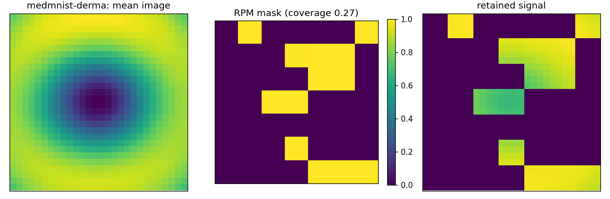
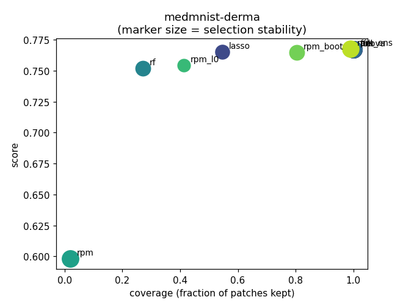

# Real-Data Benchmark Summary (scientific image sets)

Score is AUC (binary) or accuracy-equivalent OVR AUC (multiclass); higher is better. `coverage` is the fraction of patches kept, `stability` the mean pairwise Jaccard of selections across folds, `border_coverage` the fraction of the outer patch ring retained (a background-rejection diagnostic for centred imagery).

## medmnist-derma

| medmnist-derma | score | coverage | stability | border_coverage | seconds |
| --- | --- | --- | --- | --- | --- |
| full | 0.767 | 1.000 | 1.000 | 1.000 | 37.099 |
| anova | 0.767 | 1.000 | 1.000 | 1.000 | 42.743 |
| lasso | 0.765 | 0.547 | 0.641 | 0.517 | 106.007 |
| rfe | 0.767 | 1.000 | 1.000 | 1.000 | 35.466 |
| rf | 0.752 | 0.271 | 0.740 | 0.008 | 75.931 |
| rpm | 0.598 | 0.020 | 1.000 | 0.000 | 24.965 |
| rpm_l0 | 0.754 | 0.412 | 0.473 | 0.421 | 37.855 |
| rpm_boot | 0.765 | 0.804 | 0.748 | 0.796 | 129.344 |
| rpm_ens | 0.768 | 0.990 | 0.982 | 0.988 | 321.222 |

## Figures

