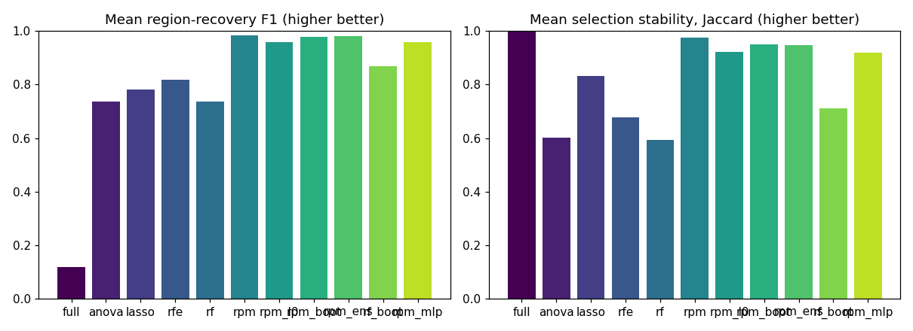
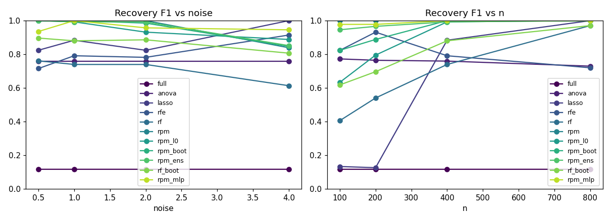
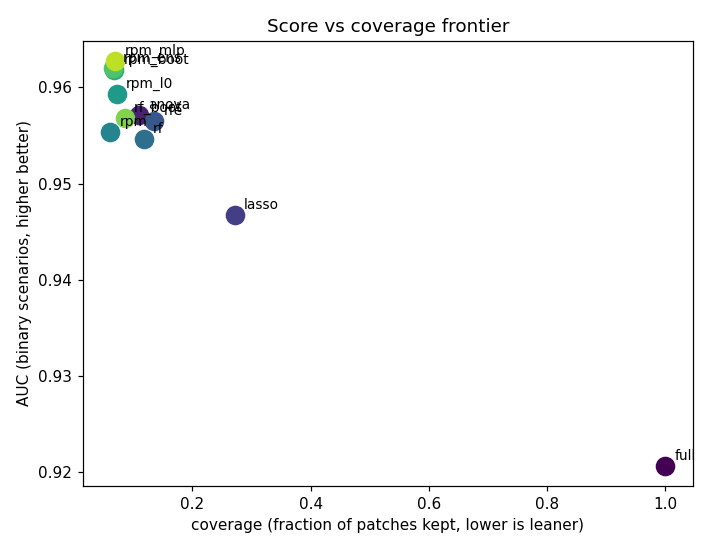

# Synthetic Benchmark Summary (synthetic)

Rows: 759  |  methods: ['anova', 'full', 'lasso', 'rf', 'rf_boot', 'rfe', 'rpm', 'rpm_boot', 'rpm_ens', 'rpm_l0', 'rpm_mlp']  |  scenarios: 23  |  seeds: [np.int64(0), np.int64(1), np.int64(2)]

Metrics: **f1/iou/precision/recall** = patch-level recovery of the known informative region; **distractor_fp** = fraction of the non-predictive distractor wrongly selected (lower better); **coverage** = fraction of patches kept; **stability** = mean pairwise Jaccard of selections across folds; **score** = AUC (binary, higher better) or RMSE (regression, lower better).

## Headline (mean over all scenarios and seeds)

| method | f1 | iou | precision | recall | distractor_fp | coverage | stability | seconds | selects |
| --- | --- | --- | --- | --- | --- | --- | --- | --- | --- |
| full | 0.119 | 0.064 | 0.064 | 1.000 | 0.957 | 1.000 | 1.000 | 3.194 | no |
| anova | 0.738 | 0.600 | 0.601 | 0.999 | 0.051 | 0.110 | 0.602 | 1.651 | yes |
| lasso | 0.782 | 0.759 | 0.759 | 1.000 | 0.201 | 0.269 | 0.833 | 2.813 | yes |
| rfe | 0.819 | 0.772 | 0.772 | 1.000 | 0.005 | 0.132 | 0.678 | 2.855 | yes |
| rf | 0.737 | 0.607 | 0.607 | 1.000 | 0.028 | 0.115 | 0.592 | 4.620 | yes |
| rpm | 0.984 | 0.978 | 1.000 | 0.978 | 0.000 | 0.061 | 0.976 | 2.011 | yes |
| rpm_l0 | 0.959 | 0.936 | 0.936 | 1.000 | 0.007 | 0.072 | 0.920 | 2.035 | yes |
| rpm_boot | 0.978 | 0.964 | 0.964 | 1.000 | 0.007 | 0.067 | 0.950 | 5.727 | yes |
| rpm_ens | 0.980 | 0.966 | 0.968 | 0.999 | 0.001 | 0.066 | 0.947 | 15.752 | yes |
| rf_boot | 0.869 | 0.786 | 0.787 | 0.998 | 0.007 | 0.085 | 0.711 | 27.638 | yes |
| rpm_mlp | 0.959 | 0.944 | 0.944 | 1.000 | 0.005 | 0.070 | 0.917 | 11.775 | yes |

`selects` is `no` where an arm kept the whole image (coverage at or above 0.999). Such an arm is not a selection result: its score is the full-image score and its stability is 1.000 because keeping everything is perfectly reproducible. Compare it against `full`, not against the selectors. A `yes` is not a claim that the arm selected WELL: coverage 0.956 is marked `yes` and is barely a selection, so read the coverage column alongside the score rather than treating this as a pass mark.

## Binary score vs coverage vs stability (mean over binary scenarios/seeds)

| method(AUC) | score | coverage | stability | f1 | selects |
| --- | --- | --- | --- | --- | --- |
| full | 0.921 | 1.000 | 1.000 | 0.120 | no |
| anova | 0.957 | 0.109 | 0.604 | 0.741 | yes |
| lasso | 0.947 | 0.272 | 0.849 | 0.795 | yes |
| rfe | 0.957 | 0.135 | 0.664 | 0.811 | yes |
| rf | 0.955 | 0.118 | 0.574 | 0.726 | yes |
| rpm | 0.955 | 0.061 | 0.975 | 0.983 | yes |
| rpm_l0 | 0.959 | 0.072 | 0.917 | 0.957 | yes |
| rpm_boot | 0.962 | 0.068 | 0.948 | 0.977 | yes |
| rpm_ens | 0.962 | 0.066 | 0.945 | 0.979 | yes |
| rf_boot | 0.957 | 0.086 | 0.698 | 0.863 | yes |
| rpm_mlp | 0.963 | 0.070 | 0.914 | 0.957 | yes |

## Recovery F1 vs noise

| noise | full | anova | lasso | rfe | rf | rpm | rpm_l0 | rpm_boot | rpm_ens | rf_boot | rpm_mlp |
| --- | --- | --- | --- | --- | --- | --- | --- | --- | --- | --- | --- |
| 0.5 | 0.118 | 0.759 | 0.824 | 0.715 | 0.761 | 1.000 | 1.000 | 1.000 | 1.000 | 0.896 | 0.936 |
| 1.0 | 0.118 | 0.759 | 0.883 | 0.791 | 0.739 | 1.000 | 0.993 | 1.000 | 0.993 | 0.880 | 1.000 |
| 2.0 | 0.118 | 0.759 | 0.824 | 0.782 | 0.739 | 1.000 | 0.931 | 0.985 | 0.993 | 0.886 | 0.957 |
| 4.0 | 0.118 | 0.759 | 1.000 | 0.914 | 0.613 | 0.839 | 0.888 | 0.847 | 0.851 | 0.807 | 0.945 |

## Recovery F1 vs sample size

| n | full | anova | lasso | rfe | rf | rpm | rpm_l0 | rpm_boot | rpm_ens | rf_boot | rpm_mlp |
| --- | --- | --- | --- | --- | --- | --- | --- | --- | --- | --- | --- |
| 100 | 0.118 | 0.772 | 0.133 | 0.823 | 0.405 | 1.000 | 0.633 | 0.824 | 0.946 | 0.618 | 0.978 |
| 200 | 0.118 | 0.764 | 0.126 | 0.931 | 0.540 | 1.000 | 0.795 | 0.888 | 0.966 | 0.696 | 0.978 |
| 400 | 0.118 | 0.759 | 0.883 | 0.791 | 0.739 | 1.000 | 0.993 | 1.000 | 0.993 | 0.880 | 1.000 |
| 800 | 0.118 | 0.729 | 1.000 | 0.720 | 0.970 | 1.000 | 1.000 | 1.000 | 1.000 | 0.970 | 1.000 |

## Recovery F1 vs signal

| signal | full | anova | lasso | rfe | rf | rpm | rpm_l0 | rpm_boot | rpm_ens | rf_boot | rpm_mlp |
| --- | --- | --- | --- | --- | --- | --- | --- | --- | --- | --- | --- |
| 1.0 | 0.118 | 0.759 | 0.824 | 0.816 | 0.739 | 1.000 | 0.931 | 0.985 | 0.993 | 0.886 | 0.957 |
| 2.0 | 0.118 | 0.759 | 0.883 | 0.791 | 0.739 | 1.000 | 0.993 | 1.000 | 0.993 | 0.880 | 1.000 |
| 3.0 | 0.118 | 0.759 | 0.882 | 0.831 | 0.719 | 1.000 | 0.993 | 1.000 | 1.000 | 0.867 | 1.000 |

## Recovery F1 vs region size

| region_side | full | anova | lasso | rfe | rf | rpm | rpm_l0 | rpm_boot | rpm_ens | rf_boot | rpm_mlp |
| --- | --- | --- | --- | --- | --- | --- | --- | --- | --- | --- | --- |
| 1 | 0.031 | 0.500 | 1.000 | 0.550 | 0.664 | 1.000 | 1.000 | 1.000 | 0.878 | 0.833 | 0.483 |
| 2 | 0.118 | 0.703 | 0.875 | 0.954 | 0.727 | 1.000 | 1.000 | 0.993 | 0.993 | 0.882 | 0.993 |
| 3 | 0.247 | 0.884 | 0.254 | 0.731 | 0.875 | 0.798 | 0.989 | 0.996 | 0.996 | 0.944 | 0.996 |

## Figures

